<h1>
  
</h1>

<h1>
  
  
  
  
  <ul align="center">
    Icons by
      <a href=https://github.com/syvixor/skills-icons>
        @syvixor ✨
      </a>
    &#160;&#160;
  </ul>
</h1>

<h1>
  
  
  
  
</h1>
<h1 align="center">Acadêmico</h1>
<h1 align="center">
  
</h1>

